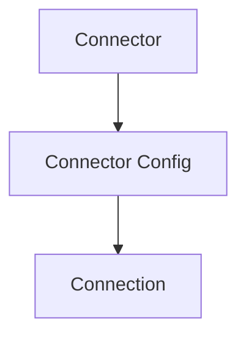
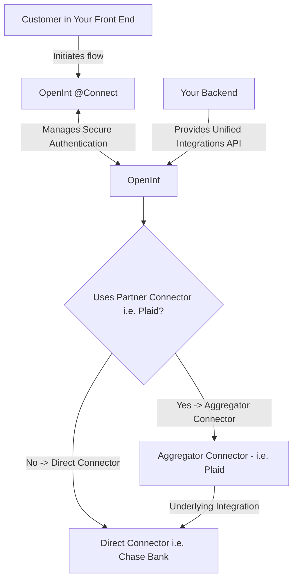

# Definitions

- **Connector**: A connector is a standardized interface to interact with various third-party services. A connector can be `direct` or `aggregator`.
- **Connector Config**: A connector config is a configuration for a connector.
- **Connection**: A connection is a connection to a third-party service.
- **Customer**: A customer is a user of your application. They can belong to a `customer organization`.

## Data Flows

