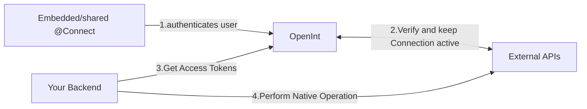

OpenInt is **the fastest way** to add native product integrations to your app.

OpenInt helps developers connect their apps to the universe with fully managed integration authentication.

## Watch our 1-minute Demo Video

<Frame>
  <iframe
    width="700"
    height="315"
    src="https://www.youtube.com/embed/FpG7otZZhRw"
    frameborder="0"
    allow="accelerometer; autoplay; clipboard-write; encrypted-media; gyroscope; picture-in-picture"
    allowfullscreen></iframe>
</Frame>

## How Does OpenInt Work?

OpenInt offers a unified experience for integrations authentication.

It all starts with OpentInt @Connect: a fully featured embeddable integrations portal. It can be shared as a link with your customers or embedded straight into your app.

@Connect communicates directly with OpenInt who then ensures that by the time that you need to perform any operation on an external API you can get a fresh access tokens.

## How is OpenInt different?

1. **Turnkey**: Launch with our pre-approved Apps and no-code embeddable integrations connect experience.
2. **Comprehensive**: Access hundreds of integrations directly and thousands via aggregators like Plaid, Merge and Finch.
3. **Builder's choice**: Open Source and entirely focused on authentication, developer experience and performance.
